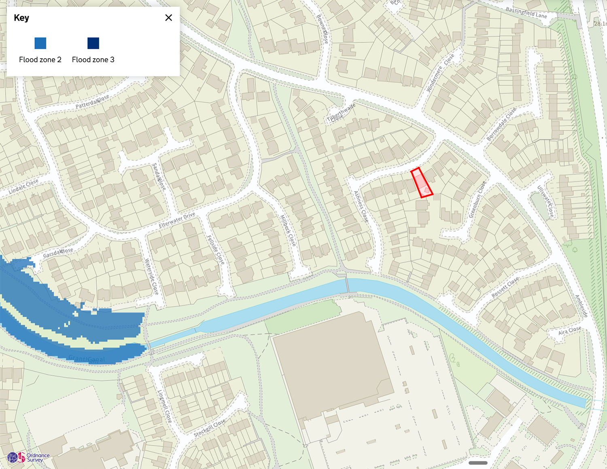
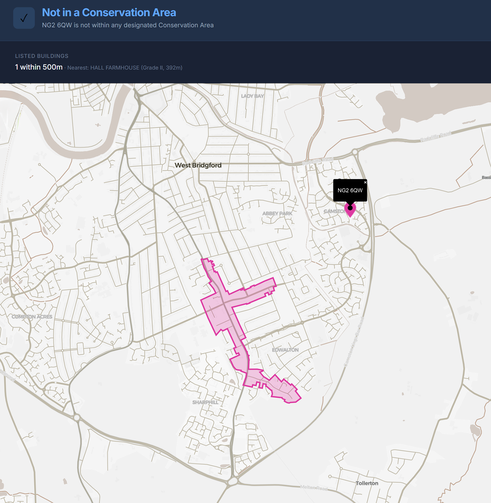
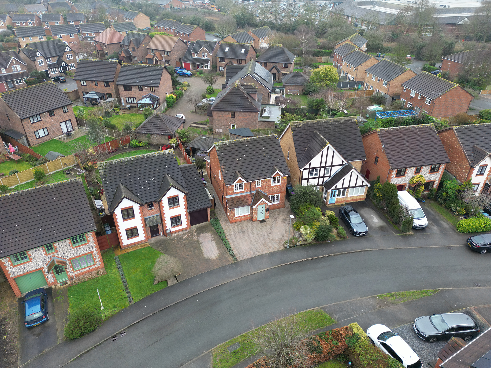
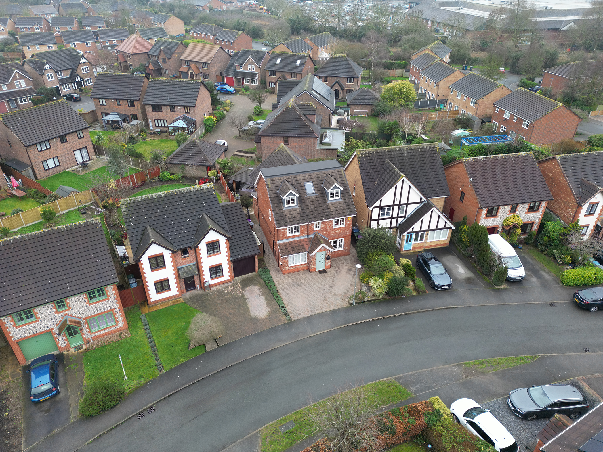
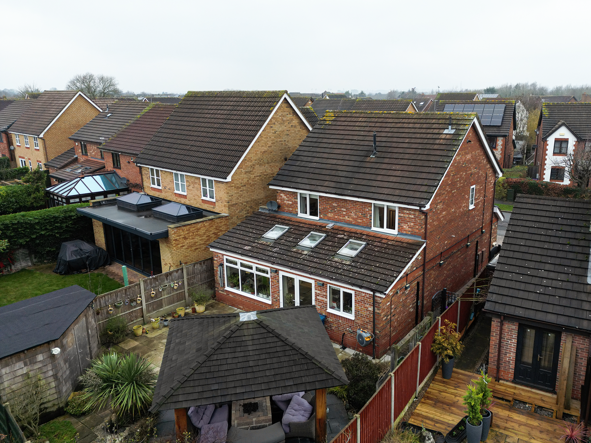
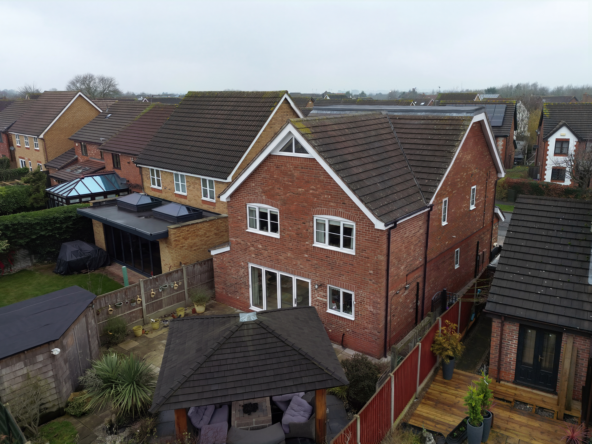
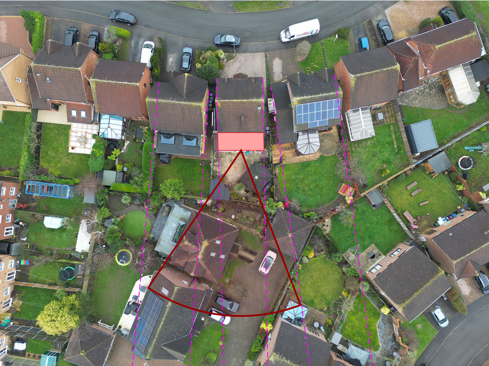
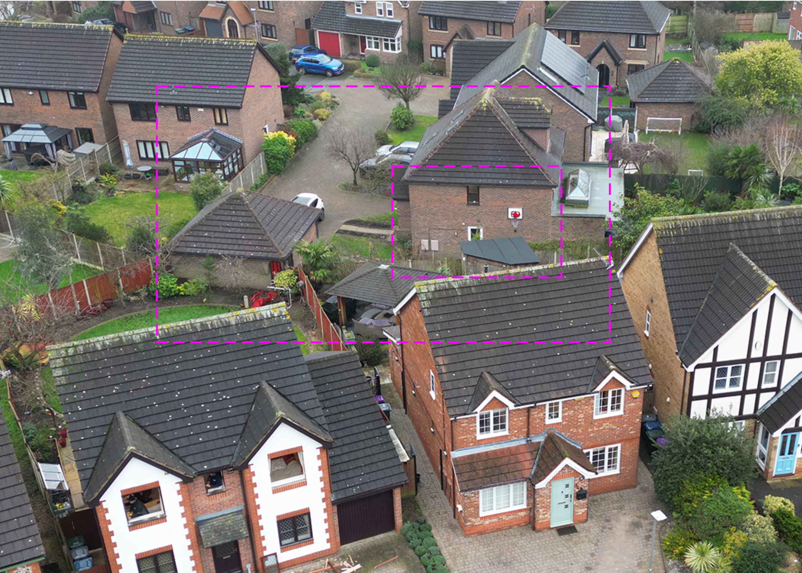
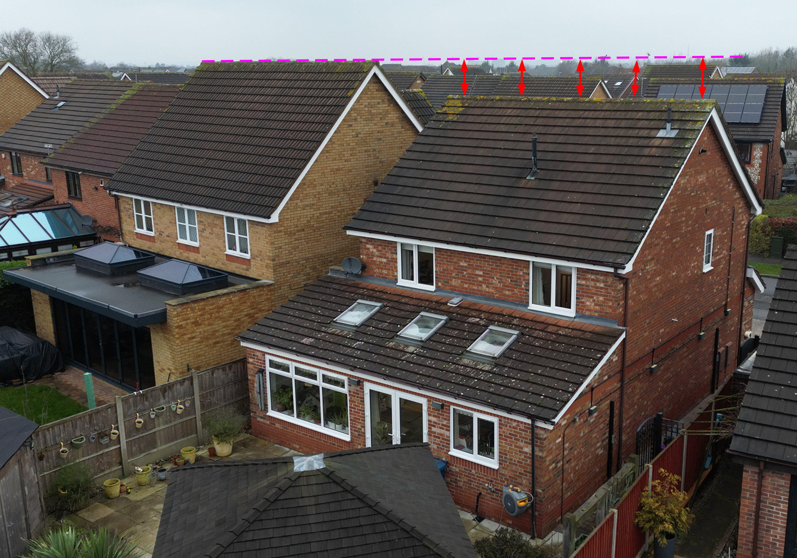
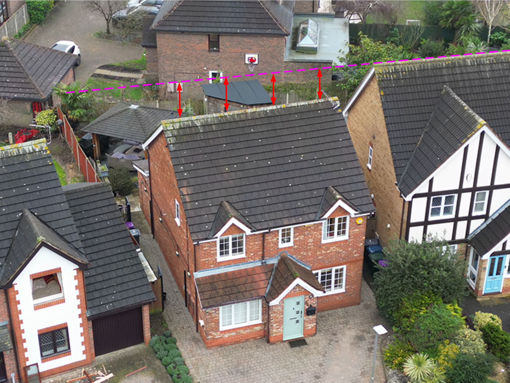

## Design and Access Statement

##### Applicant: 

Dr Nagendra Pinnamaneni

##### Site Address:

7 Ashness Close
Gamston
Nottingham
NG2 6QW

##### Prepared By:

Mr Adam Noble of Noble Architecture on behalf of Dr Pinnamaneni

##### **Document Version**

Revision A   *-  30ᵗʰ March 2026*

|  Horizontal Page Divider Line   |<-- - - - - - - - - - - - - - - - -|  */ 
    text-align           :     center;    
    padding-top          :    05.00mm;    /*  <--- Space Above The Divider Line  */
    padding-bottom       :    05.00mm;    /*  <--- Space Below The Divider Line  */
    margin-top           :    00.00mm;    
    margin-bottom        :    00.00mm;    
    ">                                   
    
                               
    
                                

  

##### 1.0  | Introduction

This Design and Access Statement has been prepared in support of a householder planning application at 7 Ashness Close. The application site currently comprises a detached dwelling. The proposal seeks to provide essential additional living accommodation and storage space to facilitate multi generational family living. The scheme has been thoughtfully designed to remain entirely within the existing ground floor footprint of the property.

#### Project Drivers And Accommodation Needs

The fundamental driver for this application is the evolving needs of the applicants family. This directly reflects the growing necessity for multi generational living within the UK amidst the current housing crisis. The applicants urgently require space to accommodate aging parents moving back into the family home. Alongside this requirement the applicants must provide their son with an enlarged bedroom and a custom built study area to support his upcoming sixth form and university education. Furthermore to alleviate general domestic clutter one of the existing bedrooms will be repurposed as a dedicated store room.

#### Justification For First Floor Expansion

Ideally accommodation for aging parents with mobility considerations would be situated on the ground floor. However the applicants consciously imposed a strict design constraint upon themselves to protect the existing garden space and prevent any further sprawling development across the modest curtilage. Consequently they actively discounted a new ground floor extension in favour of a more financially intensive upward expansion approach. The fairest and most practical solution is to utilise the existing first floor bedroom located immediately at the top of the staircase. This strategic positioning allows for the future installation of a stairlift. This renders the space effectively as accessible as a ground floor suite while successfully containing the development within the existing footprint.

#### Proposed Architectural Enhancements

Accommodating the aging parents on the first floor necessitates the applicants relocating to a newly created master suite situated within a sensitively converted loft space. Simultaneously to secure the additional space required for the sons bedroom and study the proposal extends delicately above the existing single storey rear extension. Crucially this upward extension presents a valuable opportunity to rectify and significantly enhance the architectural quality of the rear elevation. The existing rear addition features a poorly composed and visually unresolved roof element. The proposed scheme replaces this visually discordant element with a newly configured pitched glazed roof arrangement. Furthermore the new windows have been carefully scaled and detailed to incorporate original architectural features such as the segmented brick arches found elsewhere on the surrounding estate. This ensures the addition reads as a cohesive part of the building.

#### Commitment To Sympathetic Design

As detailed in the subsequent sections of this statement the design ethos is firmly rooted in preserving the vernacular and architectural integrity of the host dwelling. By avoiding visually detrimental features like bulky box dormers and instead introducing carefully proportioned pitched roof dormers the scheme successfully integrates the new additions. Ultimately this proposal delivers a high quality and thoroughly justified family expansion that rectifies past unsympathetic additions and rigorously protects the character of the property and the surrounding street scene.

The subsequent sections of this Design and Access Statement provide a comprehensive and granular analysis of the proposed development. Dr Nagendra and his family have a demonstrable need for the additional space and this document outlines the strong planning justification for the scheme. Throughout the design process we have taken a proactive approach to identify potential planning constraints and site sensitivities. The following sections clearly demonstrate how every potential issue has been carefully considered and how any perceived adverse impacts have been successfully mitigated or entirely eliminated through high quality architectural design. We respectfully submit that this diligent approach effectively addresses all material planning considerations and paves the way for a positive and expedient determination.

|  Horizontal Page Divider Line   |<-- - - - - - - - - - - - - - - - -|  */ 
    text-align           :     center;    
    padding-top          :    05.00mm;    /*  <--- Space Above The Divider Line  */
    padding-bottom       :    05.00mm;    /*  <--- Space Below The Divider Line  */
    margin-top           :    00.00mm;    
    margin-bottom        :    00.00mm;    
    ">                                   
    
                               
    
                                

  

### 2.0  | Site Context And Assessment

7 Ashness Close is a four bedroom detached family dwelling situated within a broadly cohesive residential estate. While the primary street facing elevation remains largely unaltered save for a highly sympathetic and well integrated historic garage conversion the rear elevation presents a different narrative. 

The existing single storey rear structure relies on a disproportionately large and visually intrusive parapet wall on the side elevation, and a low slung uncharacteristic mono-pitched roof. This is an unsympathetic historical addition that relates poorly to the original character of the host dwelling. It is evidently a low budget attempt that has spoiled the rear aspect of the property.

The property is currently a single-family C3 dwellinghouse and will remain so, thus no change of classification is required.. 

#### 2.1 - The Surrounding Area

The property is located within the wider Gamston development which was constructed as a mass volume housing programme during the late 1990's and early 2000's. The overarching architectural language of the estate is typical of this era attempting to echo traditional vernacular styles with varying degrees of success. While some property types within the estate feature detailed ornamentation others from the more affordable categories present a much more austere facade. Regardless of these variations there is a distinct and established character across the wider estate.

#### 2.2 - Materials And Construction

Despite the variation in dwelling types the original development consistently utilises a familiar palette of traditional materials. The prevailing construction method across the estate is typical of the period relying heavily on standard brickwork and tiled roofs. This established material context is a key consideration for the proposed scheme ensuring that any new architectural additions remain visually harmonious with the wider street scene and respect the local vernacular and design language.

|  Horizontal Page Divider Line   |<-- - - - - - - - - - - - - - - - -|  */ 
    text-align           :     center;    
    padding-top          :    05.00mm;    /*  <--- Space Above The Divider Line  */
    padding-bottom       :    05.00mm;    /*  <--- Space Below The Divider Line  */
    margin-top           :    00.00mm;    
    margin-bottom        :    00.00mm;    
    ">                                   
    
                               
    
                                

  

### 3.0  | Site Constraints: 

The following assessment of site constraints has been informed by a comprehensive review of openly available public records and online mapping services. This ensures all relevant planning constraints have been identified and addressed prior to the design phase.

#### 3.1 - Heritage And Conservation

The application site is not situated within a designated Conservation Area. The closest designated heritage boundary is the Edwalton Conservation Area which is located a significant distance to the southwest of the site as demonstrated in Figure 3.1. Furthermore the host dwelling is not a statutory Listed Building. Public records indicate that the nearest listed structure is Hall Farmhouse which is a Grade II listed building situated approximately 392 metres away. Given this substantial separation distance the proposed development will have absolutely no adverse impact on the setting or significance of any local heritage assets.

#### 3.2 - Flood Risk Evaluation

A review of the official flood risk mapping confirms that the property is situated entirely within Flood Zone 1. As shown in Figure 3.2 the site is safely situated outside of both Flood Zone 2 and Flood Zone 3. The property is therefore at the lowest possible statistical risk of flooding and a dedicated Flood Risk Assessment is not required for this householder application.

#### 3.3 - Arboriculture Impact

There are no trees within the application site curtilage or immediately adjacent to the property boundaries that are subject to a Tree Preservation Order. Furthermore the proposed scheme is entirely contained within the existing footprint of the dwelling. Therefore the development will not result in any adverse impacts on existing landscaping root protection areas or local arboricultural amenity.

​					**Fig 3.1  -**  Site vs Conservation Areas Locally 

​					**Fig 3.2  -**  Site vs Conservation Local Flood Risk

|  Horizontal Page Divider Line   |<-- - - - - - - - - - - - - - - - -|  */ 
    text-align           :     center;    
    padding-top          :    05.00mm;    /*  <--- Space Above The Divider Line  */
    padding-bottom       :    05.00mm;    /*  <--- Space Below The Divider Line  */
    margin-top           :    00.00mm;    
    margin-bottom        :    00.00mm;    
    ">                                   
    
                               
    
                                

  
### 4.0 |  Design Strategy

#### 4.1 |  Usage Of The Proposal

The property will remain a residential dwelling. The application is strictly a householder application. The fundamental design choices consolidate multiple generations of a family into a single home. The primary aim is to provide comfortable and accessible accommodation for the ageing parents of the applicant. The secondary aim is to provide the son with an appropriate living and studying environment. He plans to continue his higher education locally to avoid exorbitant university accommodation costs and additional student debt. 

To facilitate this he requires a larger room with a dedicated private study space which has been carefully integrated into the scheme. We have specifically designed a study nook situated under the new staircase leading to the second floor. The applicant and his partner will relocate to the newly formed top floor. Their current bedroom situated immediately at the top of the first floor landing will be repurposed for the ageing parents. This room is already equipped with an essential en suite bathroom which will be adapted for accessibility. The ground floor staircase leads directly to this room facilitating the future installation of a stairlift to address the parents mobility requirements.

#### 4.2 |  Space Required By The Proposal

The proposal completely avoids expanding the existing ground floor footprint. Early design explorations considered a ground floor extension and internal reconfiguration to create an accessible annexe. This approach was ultimately discarded to prevent further sprawling development across the plot. Expanding into the rear garden would have inevitably cast additional shadows over the private amenity spaces of neighbouring properties. Consequently the design strategy focuses on extending upwards over the existing footprint. The proposal adds first floor accommodation over the rear extension expanding the two rear bedrooms to better suit the needs of the son. Furthermore we have proposed a highly sympathetic loft conversion creating a new master suite for the applicants in lieu of retaining their current bedroom.

#### 4.3 |  Scale And Massing

The scale and massing of the proposed additions have been rigorously controlled to remain subservient to the host dwelling and the wider street scene. To secure the necessary internal head height for the loft conversion without creating an overbearing structure the applicant consciously opted to cap the proposed ridge height This was achieved by flattening the apex into a crown roof design mimicking a traditional pitched roof from the principal elevations. This avoids raising the ridge to an unacceptable height which a traditional apex roof would necessitate. At the rear the reorientation of the residual roof pitch allows for a dramatic reduction in the height and massing of the bulky parapet wall. This crucial alteration ensures the side elevation returns to a much more subservient appearance.

                                       
    
                               
    
                                

  

### 5.0 |  Appearance And Materials

#### 5.1 |  Introduction To Proposed Materials And Aesthetic 

The overarching aesthetic strategy is rooted in a high quality and entirely complementary approach. To ensure strict visual consistency with the host dwelling and the wider street scene all external brickwork and roofing materials will precisely match the existing property.

On the principal elevation the proposed pitched roof dormers have been specifically designed to echo the scale roof pitch and visual language of the original eaves gablets. Furthermore these dormers will utilise the exact same cottage bar style glazing present on the existing dwelling. This ensures the loft conversion reads as a natural and sympathetic evolution of the original architecture.

The rear elevation has been carefully detailed to rectify the austere nature of the previous extension. The design introduces segmented brick arches above the new first floor windows and brick soldier courses over the ground floor openings. These decorative brick embellishments are entirely in keeping with the established architectural motifs of the surrounding estate. 

At the ground floor a new four panel folding door system will be installed to create a seamless transition to the garden and the residual low slung roof will be replaced with a newly configured pitched glazed roof to improve light and proportions.

Finally neighbouring privacy amenity is rigorously protected. The new loft rear window facing adjacent properties will feature obscure glazing and high sill levels to prevent any perceived or actual overlooking.

    

#### 5.2 |  Material Specification Comparison Table

| Building Element | Existing Materials | Proposed Materials                                           |
| :----------------------------------------------------------- | :----------------------------------------------------------- | :----------------------------------------------------------- |
| **External Brickwork**                                       | Standard red facing brickwork                                | Facing brickwork to strictly match existing in colour, size, tone, texture, and mortar colour. To include matching decorative soldier courses and segmented arches. |
| **Pitched Roofs**                                            | Profiled roof tiles                                          | Roof tiles to identically match the existing profile, material, and colour. |
| **Crown Roof Flat Section**                                  | Not applicable                                               | Specification unknown at this stage. Likely EPDM or GRP system at the discretion of the building contractor. |
| **Front Windows**                                            | White UPVC with cottage bar detailing                        | White UPVC with cottage bar detailing to seamlessly match existing windows on front and side elevations. |
| **Rear Windows**                                             | White UPVC                                                   | White UPVC                                                   |
| **Rear Doors**                                               | White UPVC French doors                                      | White UPVC or aluminium four panel folding door system.      |
| **Roof Glazing**                                             | Standard roof windows on existing rear extension             | Velux roof windows and a new bespoke pitched glazed roof system. |
| **Fascias And Soffits**                                      | White UPVC                                                   | White UPVC to match existing.                                |
| **Rainwater Goods**                                          | Black UPVC gutters and downpipes                             | Black UPVC gutters and downpipes to match existing.          |

    

### 5.3 |  Existing Conditions vs Design Proposal Images

​		**Fig 5.1  -**  Existing Street Scene

​		**Fig 5.2  -**  Artist’s Impression of the Design Proposal

​		**Fig 5.3  -**  Existing Rear View 

​		**Fig 5.4  -  **An Artist’s Impression of the Proposed Rear View

|  Horizontal Page Divider Line   |<-- - - - - - - - - - - - - - - - -|  */ 
    text-align           :     center;    
    padding-top          :    05.00mm;    /*  <--- Space Above The Divider Line  */
    padding-bottom       :    05.00mm;    /*  <--- Space Below The Divider Line  */
    margin-top           :    00.00mm;    
    margin-bottom        :    00.00mm;    
    ">                                   
    
                               
    
                                

  

### 6.0 |  Protection To Neighbours Privacy

#### 6.1 |  Site Placement And View Lines

The application site is exceptionally well placed to accommodate the proposed extension without compromising the residential amenity or privacy of adjacent occupiers. As clearly illustrated in the submitted aerial view the new first floor windows do not invade neighbouring properties. The primary field of view is directed towards the side elevation of the adjacent dwelling. The only window present on this facing elevation features obscured glass and is likely serving a non habitable bathroom space.

Furthermore the purple dotted lines superimposed on the aerial photograph demonstrate that the neighbouring building lines tilt away from the direct lines of sight. This angular offset provides a considerable benefit by naturally mitigating any potential overlooking. The remainder of the visible view cone is largely occupied by the neighbours driveway and parking area rather than any sensitive private garden space.

#### 6.2 |  Second Floor Window Placement

The protection of neighbouring privacy has been a paramount consideration in the architectural layout of the new second floor. To completely eliminate any potential for overlooking the new dormer windows have been strategically and exclusively positioned on the principal front elevation. These windows only overlook the public street scene and the front elevations of the properties situated across the road.

It is vital to emphasise that there is absolutely no direct viewing into any private rear gardens from the new second floor habitable spaces. There are zero rear facing clear glazed windows that could invade the privacy of any neighbours. This deliberate design strategy ensures the proposal is entirely sympathetic to the privacy expectations of all surrounding residents Introducing  zero new overlooking concerns of note.

    

​	**Fig 6.1  -**  Showing first story Field of View.

​	**Fig 6.2  -**  Showing the areas visible from the first floor windows.

|  Horizontal Page Divider Line   |<-- - - - - - - - - - - - - - - - -|  */ 
    text-align           :     center;    
    padding-top          :    05.00mm;    /*  <--- Space Above The Divider Line  */
    padding-bottom       :    05.00mm;    /*  <--- Space Below The Divider Line  */
    margin-top           :    00.00mm;    
    margin-bottom        :    00.00mm;    
    ">                                   
    
                               
    
                                

  

### 7.0 |  Roof Replacement Justification

The provided aerial imagery illustrates a clear common sense argument regarding the existing roof heights within the immediate street scene. The primary justification is founded upon the undeniable visual evidence that the adjacent building at number 9 was originally constructed with a considerably taller roof structure and a noticeably steeper pitch. The visual evidence clearly demonstrates that the neighbouring roof pitch is at least ten degrees steeper and significantly higher than the applicants existing roof.

As a secondary contributing factor to this height disparity the neighbouring property also occupies a slightly elevated topographical position. The neighbours terrace level sits marginally higher than the application site. The combination of the inherently taller architectural roof design and this slight topographical offset establishes a very clear and robust precedent for a higher permissible ridge line on Ashness Close.

To secure the necessary internal head height and usable floor area for the loft conversion the proposal features a new crown roof. The current roof structure utilises restrictive fink style trusses meaning a complete roof replacement is fundamentally required. A traditional apex roof was discounted as it would raise the ridge to an unacceptable height.

Despite the clear precedent set by the much taller neighbouring property the applicant consciously opted to cap the proposed ridge height by flattening the apex into a crown design. Our primary aim was to be overly careful and avoid raising the height over the current mass wherever possible. While this is a more financially intensive structural solution this approach successfully mimics a traditional pitched roof from the principal front and rear elevations. This ensures the design remains faithful to the original roof height and close to the original pitch and guarantees rigorous protection to the established character of the street scene.

    

​		**Fig 7.1  -**   Comparison of the neighbouring ridge height relative to the applicant’s dwelling.

​		**Fig 7.2  -**   Comparison of the neighbouring ridge height relative to the applicant’s dwelling.

|  Horizontal Page Divider Line   |<-- - - - - - - - - - - - - - - - -|  */ 
    text-align           :     center;    
    padding-top          :    05.00mm;    /*  <--- Space Above The Divider Line  */
    padding-bottom       :    05.00mm;    /*  <--- Space Below The Divider Line  */
    margin-top           :    00.00mm;    
    margin-bottom        :    00.00mm;    
    ">                                   
    
                               
    
                                

  

### 8.0 |  Landscaping Garden & Vegetation

The proposed development introduces no material changes whatsoever to the current landscaping scheme. The existing garden and private amenity space will not be adjusted or compromised. The design proposal is almost entirely concentrated from the first floor of the building upwards. While there is a minor alteration involving the insertion of an additional window on the ground floor eastern elevation this does not require any new footings or groundworks. Consequently there will be absolutely no disruption to the existing external ground levels or landscaped surfaces. The only exception to this would be the highly unlikely event that a qualified structural engineer deems isolated underpinning necessary during the subsequent technical design phase.

Furthermore there are no existing trees shrubs or soft landscaping elements scheduled to be removed cut back or altered to facilitate this development. All existing boundary treatments including fences and walls will remain exactly as they are currently. This ensures the continued security and established privacy lines of both the application site and the neighbouring properties are fully maintained without interruption.

|  Horizontal Page Divider Line   |<-- - - - - - - - - - - - - - - - -|  */ 
    text-align           :     center;    
    padding-top          :    05.00mm;    /*  <--- Space Above The Divider Line  */
    padding-bottom       :    05.00mm;    /*  <--- Space Below The Divider Line  */
    margin-top           :    00.00mm;    
    margin-bottom        :    00.00mm;    
    ">                                   
    
                               
    
                                

  

### 9.0 |  Site Access

#### 9.1 |  Vehicular Access And Parking

The proposal does not alter the existing vehicular access from Ashness Close. The property currently benefits from a substantial block paved driveway to the principal elevation which provides generous off street parking for multiple vehicles. This existing parking provision will be fully retained. While the proposal consolidates multi generational living the extensive existing driveway ensures there is ample capacity to absorb any associated parking demand without negatively impacting the local highway network.

#### 9.2 |  Inclusive Access

The scheme has been specifically designed to improve inclusive access for all generations of the family. The new four panel folding door system on the rear elevation will be installed with a flush threshold to the garden space. This significantly improves transition and accessibility compared to traditional stepped arrangements. Furthermore the internal layout actively anticipates future mobility requirements by facilitating the installation of a stairlift to the first floor suite for the ageing parents. 

|  Horizontal Page Divider Line   |<-- - - - - - - - - - - - - - - - -|  */ 
    text-align           :     center;    
    padding-top          :    05.00mm;    /*  <--- Space Above The Divider Line  */
    padding-bottom       :    05.00mm;    /*  <--- Space Below The Divider Line  */
    margin-top           :    00.00mm;    
    margin-bottom        :    00.00mm;    
    ">                                   
    
                               
    
                                

  
### 10.0 |  Conclusion

The proposed development has been meticulously designed to respect and enhance the character and appearance of the host dwelling and the wider street scene. It provides essential and much needed modernised living space to facilitate multi generational family living for the applicants. Crucially this is achieved without causing any detrimental harm to the residential amenity privacy or sightlines of any neighbouring occupiers.

The comprehensive evidence and high quality documentation submitted within this application present an undeniably robust and common sense case for approval. Every potential planning consideration has been proactively identified addressed and successfully mitigated through sympathetic and high quality architectural design. The proposal firmly aligns with the surrounding architectural vernacular and strictly complies with Rushcliffe Borough Council Local Plan Policies and the overarching principles of the National Planning Policy Framework. 

Given the overwhelming contextual evidence the complete lack of adverse impacts and the clear functional need for the accommodation we respectfully submit that the scheme represents considerate and well thought out development. We therefore formally request that planning permission be granted without delay.

    

    

  
    <h6 style="margin-top:02.00mm;font-size:08.00pt;font-color:#ebebeb;">Note To Reader : End Of Main Statement</h6>

  

## Supplementary Drawing Notes

This section consolidates the notes embedded throughout the formal planning drawing pack. These annotations have been compiled here to provide the planning officer with an accessible and comprehensive reference guide detailing the specific design intentions and technical considerations of the proposal. Providing these notes in a centralised location ensures efficient navigation and clarity regarding the overall design strategy.

    

### North Elevation

The Northern Elevation of the property faces the street (Ashness Close) and serves as the building's principal elevation.

##### NB01 |  Front Facing Dormer Windows

Careful attention has been paid to the front elevation to ensure the proposed loft conversion seamlessly integrates with the established character of the property and the wider estate. The original front elevation is characterised by distinct front-facing eaves gablets, a defining architectural motif that is prevalent on properties throughout the surrounding estate. To respect and reflect this local vernacular, the proposed pitched-roof dormers have been specifically designed to echo the scale, roof pitch, and visual language of these original gablet features. Furthermore, the new dormer windows utilise the exact same cottage bar style glazing present on the existing dwelling. This ensures strict visual consistency, remaining faithful to both the original house and the established aesthetic of the wider estate. By successfully translating these defining characteristics to the new roof level, the proposed dormers harmonise directly with the host dwelling and maintain the cohesive rhythm of the street scene, ensuring the loft conversion reads as a natural, sympathetic evolution of the original architecture.

##### NB02 | Main Roof Replacement

To secure the necessary internal head height and usable floor area for the loft conversion, the proposal features a new crown roof. The current roof structure utilises restrictive fink-style trusses, meaning a complete roof replacement is fundamentally required. A traditional apex roof was discounted as it would raise the ridge to an unacceptable height. As evidenced by the drone imagery in the Design and Access Statement, the neighbouring property at No. 9 occupies an elevated topographical position with a significantly steeper, taller roof structure, establishing a clear precedent for a higher permissible ridge line on Ashness Close. Despite this precedent, the applicant consciously opted to cap the proposed ridge height by flattening the apex into a crown design. While a more financially intensive structural solution, this approach successfully mimics a traditional pitched roof from the principal front and rear elevations, remaining faithful to the original roof pitch and rigorously protecting the established character of the street scene.

The contractor is responsible for all technical roof design and coordinating the scheme with an attic truss manufacturer (e.g., Trusstec or similar). All insulation, vapour control, and structural elements must be designed and specified in full compliance with current Building Regulations.

    

### South Elevation

The Southern Elevation of the property faces the rear garden.

##### NB10 |  Rear Door Opening Alterations

The proposal removes the existing large window, wall nib, and rear patio doors to form a single, enlarged structural opening. The aim is to better align the window reveals, rectifying the previous extension where openings were added ad hoc without thought for rhythm. A new four-panel folding door system will be installed, featuring a master door for routine garden access and three folding panels to create a seamless transition between the kitchen and garden when required. The new structural opening requires a steel beam; load-bearing specifications must be certified by a qualified structural engineer and comply with all required Building Regulations prior to construction.

##### NB11 |  Roof Replacement and New Glazed Roof Section

The addition of the first-floor extension over the main body of the existing rear extension leaves a narrow, residual section of the ground-floor footprint. Retaining the existing roof arrangement here would result in an awkward and visually unresolved slender mono-pitched element. The existing structure currently relies on a disproportionately large and visually intrusive parapet wall on the side elevation which is an unsympathetic historical addition that relates poorly to the original character of the host dwelling. 

To resolve these architectural issues, the proposal includes replacing this residual roof section with a newly configured pitched glazed roof. By reorienting the roof pitch to span the shorter dimension, the proposal facilitates a dramatic reduction in the height and massing of the bulky parapet wall. This crucial alteration removes a visually jarring element, returning the side elevation to a much more subservient and sympathetic appearance. 

Crucially, introducing this new glazed roof section allows us to entirely reorganise the rear elevation. The original rear facade is visually disjointed and poorly composed, featuring mismatched window and door sizes that fail to align with one another. By utilising the new roof glazing to harvest abundant natural light, we gained the design freedom to reposition the existing ground-floor doors and windows. This rearrangement results in a substantially more balanced and aesthetically pleasing rear elevation, where the south facing doors & windows now align cohesively.

##### NB12 |  Rear Facing Obscured Glass Window

To protect the privacy amenity of neighbouring properties, a conscious and strategic design decision was made regarding the glazing position and extent on the south-facing rear elevation of the new loft space. Rather than introducing a large, clear-glazed window that could facilitate unacceptable overlooking, our proposal incorporates a single, high-level window situated within the gable apex to serve the new en-suite bathroom. 

This window will be fitted with obscure glazing and positioned with a sill height exceeding 1.7 meters above the internal floor level, strictly adhering to established planning guidance for privacy protection. This considerate approach ensures the en-suite benefits from essential natural daylight while entirely mitigating any perceived or actual risk of overlooking and loss of privacy for adjacent occupiers.

##### NB13 | Decorative Brick Embellishment

The proposed rear elevation features segmented brick arches above the new first floor window openings and brick soldier courses over the ground floor openings. These specific architectural details have been deliberately introduced to provide necessary ornamentation to what would otherwise be a plain and drab facade. These motifs are entirely in keeping with the established architectural style prevalent throughout the surrounding estate.

|  Horizontal Page Divider Line   |<-- - - - - - - - - - - - - - - - -|  */ 
    text-align           :     center;    
    padding-top          :    05.00mm;    /*  <--- Space Above The Divider Line  */
    padding-bottom       :    05.00mm;    /*  <--- Space Below The Divider Line  */
    margin-top           :    00.00mm;    
    margin-bottom        :    00.00mm;    
    ">                                   
    
                               
    
                                

  

### East Elevation 

The Eastern Elevation forms the side of the property facing 05 Ashness Close.

##### NB21 | New Additional Side Windows 

Careful consideration has been given to the new windows proposed on the eastern side elevation to ensure openings remain subservient and sympathetic to the host dwelling. The newly introduced windows have been deliberately designed as modest, proportionately small openings that are highly appropriate for a secondary side elevation. To maintain a cohesive visual appearance across the property, these windows have been chosen to replicate the traditional cottage bar design already present on the existing elevation. These proportionate additions are strictly functional, providing essential natural light and ventilation to the newly formed ground-floor WC and the new first-floor store room, while respecting the overall architectural character of the building and mitigating any potential impact on neighbouring privacy amenity.

    

### West Elevation

The Western Elevation of the property faces the neighbour (No9. Ashness Close) and is one of the sideward facing elevations.

##### NB31 | Side Elevation Velux Roof Windows

The proposal introduces a combined Velux window arrangement on the side elevation, comprising a top-opening roof window (Velux size code PK08) and a fixed bottom pane (Velux size code PK04). Located above the dressing area within the new master suite, this glazing acts as a vital light well, drawing ample natural light into the rear of the loft extension and creating a high-quality internal feature. This side-facing position was strategically chosen to protect neighbouring privacy. As the adjacent property at No. 9 sits on a significantly higher topographical elevation, the risk of overlooking is inherently minimised; however, the applicant is fully agreeable to fitting the fixed lower pane with obscure glass should the planning officer deem it necessary to further safeguard neighbouring residential privacy amenity.

    

### Floor Plan Specific Notes

##### NB41 | New Ground Floor WC

The proposal introduces a new ground-floor WC, formed by internally partitioning a section of the existing study. This space features a newly formed window on the eastern side elevation to provide natural light and ventilation. The contractor is responsible for all associated pipework, drainage, and mechanical ventilation, which must be designed and installed in full compliance with current Building Regulations.

##### ST01 |  Potential Structural Column

Noble Architecture has identified the probable need for a structural column in the position indicated "ST01" on the proposed plans. This is due to the substantial span across the rear elevation, it is anticipated that mid-point support will be necessary to safely accommodate the required structural loads. While there remains a possibility that the attic truss manufacturer could engineer a solution utilising structural girders in lieu of a traditional steel beam(s) and column arrangement, this must be formally evaluated. This element is highlighted purely as a provisional point of discussion and is merely a flag. The definitive structural strategy, including all final load-bearing calculations and specifications, falls outside the scope of this appointment and must be independently confirmed and detailed by a qualified structural engineer during the subsequent Building Regulations stage.

##### ST02 |  Technical Specifications And Structural Design

The proposed scheme involves significant structural alterations including a complete roof replacement to a crown roof design and the insertion of a large rear structural opening. All load bearing elements including steel beams structural columns attic trusses and foundations must be independently designed specified and certified by a fully qualified structural engineer. Furthermore the contractor is responsible for all mechanical electrical and plumbing designs including the new ground floor washroom drainage. Noble Architecture accepts no responsibility for the structural integrity or technical performance of the proposed design.

    

##### Project Overview And Site Context

This overview summarises the more comprehensive design and access statement prepared in support of a householder planning application at 7 Ashness Close in Gamston. The fundamental driver for this proposal is the evolving needs of the applicants family directly reflecting the growing necessity for multi generational living. The applicants urgently require space to accommodate ageing parents moving back into the family home while simultaneously providing their son with an enlarged bedroom and a custom built study area for his upcoming university education. To protect the existing garden space and prevent sprawling development the applicants consciously discounted a new ground floor extension. The fairest and most practical solution is an upward expansion utilising the existing first floor bedroom at the top of the staircase for the ageing parents allowing for future stairlift installation. The applicants will relocate to a newly created master suite within a sensitively converted loft space. The property is located within the Gamston development constructed during the late nineteen nineties. The site is not within a conservation area and sits entirely within Flood Zone 1 with no protected trees on site. The proposal introduces no material changes to the current landscaping and the generous existing off street parking is fully retained.

##### Architectural Design Strategy & Materials

The scale and massing of the proposed additions have been rigorously controlled to remain subservient to the host dwelling. To secure necessary internal head height for the loft conversion without creating an overbearing structure the applicant opted to cap the proposed ridge height by flattening the apex into a crown roof design. This approach successfully mimics a traditional pitched roof from the principal elevations. The primary justification for the roof replacement is founded upon undeniable visual evidence that the adjacent building at Number 9 was originally constructed with a considerably taller roof structure and a steeper pitch establishing a clear precedent for a higher ridge line. At the rear extending over the existing single storey structure presents a valuable opportunity to enhance architectural quality. The visually discordant bulky parapet wall and poorly composed mono pitched roof will be replaced with a newly configured pitched glazed roof arrangement. The overarching aesthetic strategy ensures strict visual consistency with external brickwork and roofing materials precisely matching the existing property. The front pitched roof dormers echo the scale and visual language of the original eaves gablets utilising matching cottage bar style glazing. The rear elevation introduces segmented brick arches and soldier courses in keeping with the surrounding estate.

##### Protecting Neighbouring Privacy And Amenity

The protection of neighbouring privacy has been a paramount consideration in the architectural layout. The application site is exceptionally well placed to accommodate the proposed extension without compromising the residential amenity of adjacent occupiers. The primary field of view from the new first floor is directed towards the side elevation of the adjacent dwelling which only features an obscured glass bathroom window. To completely eliminate any potential for overlooking the new second floor dormer windows have been strategically and exclusively positioned on the principal front elevation overlooking the public street scene. There is absolutely no direct viewing into any private rear gardens from the new habitable spaces. To protect the privacy amenity of neighbouring properties the proposal incorporates a single high level window situated within the rear gable apex serving the new en suite bathroom. This window will be fitted with obscure glazing and positioned with a sill height exceeding 1.7 metres above the internal floor level strictly adhering to established planning guidance. The proposed development provides essential modernised living space while meticulously respecting the character of the street scene and strictly complying with local planning policies.

    

##### General Note | Planning Purpose Only

This document and the associated drawing pack have been prepared explicitly and exclusively for the purpose of a statutory householder planning application. To ensure absolute clarity for the local planning authority assessing the scheme the document pack is intentionally lightweight. It deliberately omits detailed technical specifications including structural arrangements wall compositions thermal insulation details and floor or roof build ups. Consequently these documents are strictly not fit for construction purposes procurement or Building Regulations approval. Comprehensive technical design and structural engineering plans must be commissioned and approved at a subsequent stage prior to the commencement of any physical works.

##### Contractor Responsibilities And Verification

The appointed building contractor is solely responsible for verifying all dimensions site levels and existing boundary conditions prior to the commencement of any fabrication ordering of materials or construction works. Any discrepancies found between these preliminary planning drawings and the physical site must be reported immediately to Noble Architecture  and the client. The contractor must not scale directly from these drawings for construction purposes. The appointed principal contractor assumes full responsibility for ensuring all executed works comply strictly with current Building Regulations local authority requirements and all relevant health and safety legislation.

##### Limitation Of Liability And Indemnity

Noble Architecture shall not be held liable for any direct indirect or consequential loss injury or damage arising from the unauthorised use of these drawings for any purpose other than obtaining town and country planning permission. The client and any subsequently appointed contractors fully indemnify Noble Architecture against any claims financial costs or legal liabilities resulting from the misuse of these drawings for construction pricing structural implementation or Building Control submissions. By proceeding with the project beyond the planning phase the client formally acknowledges the necessity of engaging appropriate technical professionals for the detailed construction phase.

##### Copyright And Intellectual Property

All designs architectural drawings written specifications and intellectual property contained within this document remain the exclusive statutory property of Noble Architecture. These documents may not be reproduced altered or distributed to third parties for any purpose other than the specific planning application at the application site without the express written consent from Noble Architecture.

    

    

  
    <h6 style="margin-top:02.00mm;font-size:08.00pt;font-color:#ebebeb;">&copy; 2026 Noble Architecture</h6>

  
