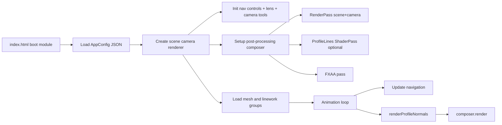
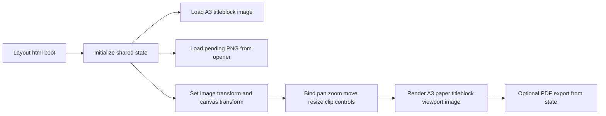

# ValeVision3D - Project Structure and Pipeline Map

## Purpose

This document maps the current ValeVision3D architecture and reconstructs the full runtime pipeline from app boot through 3D rendering, image export, and PageLayoutSystem ingestion.

It also pinpoints where profile-line (Sobel/normal-edge) output and camera projection state can diverge when generating Layout View captures.

---

## 1) Project Structure (Functional Boundaries)

### App Shell and Boot

- `index.html`
  - Defines the UI shell (header, canvas, tools dropdown, export controls, overlays).
  - Hosts the main ES module boot script that wires scene, camera, renderer, controls, loader, composer, and UI features.

### Configuration Layer

- `src__AppConfig/Na__AppConfig__Loader.js`
  - Loads JSON config from `src__AppConfig/Na__AppConfig__Main.json`.
- `src__AppConfig/Na__AppConfig__Main.json`
  - Source-of-truth for:
    - scene/camera defaults
    - model/material config
    - profile-lines render effect config
    - image export config
    - nav settings
    - post-process export effects

### Core 3D Runtime

- `src__RenderPipeline/Na__RenderPipeline__PostProcessing__Setup.js`
  - Builds `EffectComposer`, `RenderPass`, optional ProfileLines `ShaderPass`, and FXAA pass.
  - Returns `{ composer, renderProfileNormals, setProfileLinesSize }`.
- `src__RenderPipeline/Na__RenderEffect__ProfileLines__.js`
  - Builds Sobel-like normal-edge pass.
  - Creates separate normal render target.
  - Exposes `renderProfileNormals()` and size sync helper.

### Scene Navigation and Camera Tools

- `src__NavigationAndCameras/Na__DefaultNavmode__MouseControls.js`
- `src__NavigationAndCameras/Na__DefaultNavmode__IpadControls.js`
  - Orbit + movement controls, mm->units normalized behavior.
- `src__CameraUtils/Na__UiFeature__CameraLens__Controls.js`
  - Lens mm slider <-> camera FOV conversion.
- `src__CameraUtils/Na__UiFeature__CameraPosition__Controls.js`
  - Export/import camera JSON (position/rotation/FOV).

### Model Loading and Layering

- `src__ModelLoader/Na__ModelLoader__MultiModel.js`
  - Parses and classifies model URLs.
  - Loads mesh + linework pairs per category.
  - Applies render/material settings, line conversions, and ordering.

### Export System and Bridge to Layout

- `src__ImageExport/Na__UiFeature__ImageExport__Controls.js`
  - Render-to-image flow used by both Export Now and Layout View.
  - Performs temporary custom resolution/aspect render path.
  - Stores payload in `window.__Na__PageLayout__PendingImage` and opens layout tab.
- `src__ImageExport/Na__ImageExport__PostProcessEffects__Pipeline.js`
  - Optional canvas post-filters (levels, high-pass sharpen) after renderer/composer output.
- `src__ImageExport/Na__UiFeature__ImageExport__ViewportOverlays.js`
  - Safe-frame and rule-of-thirds viewport overlays for export framing.

### PageLayoutSystem (2D Composition)

- `src__PageLayoutSystem/Na__PageLayoutSystem__Layout__.html`
  - Standalone tab app shell and module boot.
- `src__PageLayoutSystem/Na__PageLayoutSystem__SystemLogic__Main__.js`
  - Reads pending image from opener, initializes state, loads title block.
- `src__PageLayoutSystem/Na__PageLayoutSystem__CanvasRenderPipeline__.js`
  - 2D canvas renderer for A3 page + title block + viewport image.
- `src__PageLayoutSystem/Na__PageLayoutSystem__2dNavigationControls__.js`
- `src__PageLayoutSystem/Na__PageLayoutSystem__Controls__Pc__.js`
- `src__PageLayoutSystem/Na__PageLayoutSystem__Controls__TouchScreen__.js`
- `src__PageLayoutSystem/Na__PageLayoutSystem__PdfExport__A3__.js`

---

## 2) Runtime Render Pipeline (3D Viewer)

### Runtime Notes

- Composer is created once after scene setup.
- If profile lines are enabled in config, a normal buffer render target + shader pass are installed.
- In the live loop, `renderProfileNormals()` is called before `composer.render()`.
- On viewport resize, camera aspect/projection, renderer size, composer size, and profile-lines size helper are updated.

---

## 3) Export-to-Layout Transfer Pipeline

```mermaid
flowchart LR
    exportClick[Layout View button] --> renderToDataUrl[RenderToDataUrl helper]
    renderToDataUrl --> composeOrRender[composer.render or renderer.render]
    composeOrRender --> postEnhance[Optional export post-process filters]
    postEnhance --> payload[Build payload dataUrl width height aspectRatio]
    payload --> openerStore[window.__Na__PageLayout__PendingImage]
    openerStore --> openLayout[window.open Layout HTML]
    openLayout --> layoutInit[PageLayout Initialize]
    layoutInit --> imageLoad[Load dataUrl image]
    imageLoad --> canvas2dRender[Draw in 2D canvas pipeline]
```

### Transfer Boundary

The strict boundary is:

- 3D side produces a PNG data URL and metadata.
- PageLayoutSystem consumes only that bitmap and metadata.
- PageLayoutSystem does not execute Three.js passes, Sobel, or camera rendering logic.

---

## 4) PageLayoutSystem Internal Pipeline (2D)

### Layout Notes

- Layout canvas is a 2D composition environment.
- It can pan/zoom the document and reposition/resize/clip the imported image.
- It does not reconstruct camera or 3D projection; it displays a pre-rendered frame.

---

## 5) Camera / Profile-Lines Dependency Points

### Where projection state lives

- Main projection state is on `Na__Camera__Main` (FOV, aspect, near/far, transform).
- Lens slider changes FOV and updates projection matrix in place.

### Where profile-lines depend on projection state

- Profile-lines normal pass renders scene using the camera currently supplied to `Na__RenderEffect__ProfileLines__Create(...)`.
- If camera aspect/FOV changes, normal pass must be refreshed for the same capture frame and resolution.

### Where export can diverge from live view

During custom export path in `Na__UiFeature__RenderToDataUrl(...)`:

1. camera aspect is temporarily changed
2. composer is resized to export dimensions
3. frame is rendered
4. camera/renderer/composer are restored

If profile normal buffer refresh/size-sync does not match this temporary export state, profile lines can look like a different projection than the color pass in the exported image.

---

## 6) Exact Mismatch Insertion Point (Current Sobel/Layout Issue)

The likely mismatch insertion point is in the export capture sequence before layout handoff:

- `Layout View` uses the same export helper as `Export Now`.
- The payload handed to layout is already baked.
- Therefore, if profile lines are wrong angle/FOV in layout but live viewer looks correct, divergence happened during export capture.

Most sensitive points:

1. `composer.setSize(targetWidth, targetHeight)` without matching profile-lines normal RT size update for that same target.
2. `camera.aspect` / `camera.updateProjectionMatrix()` changes not coupled to an immediate profile normal re-render at capture size.
3. Restoring live viewport size/state after capture without running a synchronized refresh path can hide the transient mismatch in live view while persisting it in the captured PNG.

---

## 7) Verification Checklist for Capture Correctness

Use this sequence as the contract for both custom export and layout-view export:

1. Set export camera aspect and update projection matrix.
2. Resize renderer/composer to export target.
3. Resize profile-lines normal target to export target.
4. Render profile normals with current export camera state.
5. Render composer.
6. Capture canvas/data URL.
7. Restore camera/renderer/composer/profile-lines to live viewport dimensions.

If any step is skipped or out of order, profile-line projection mismatch can appear in exported/layout images.

---

## 8) Summary

- The project is architected as a 3D render app plus a separate 2D layout app.
- Layout receives a bitmap snapshot, not live 3D state.
- Sobel/profile-lines correctness in layout is entirely dependent on export capture sequencing in the main viewer.
- The critical failure surface is camera/projection and profile-normal buffer synchronization during temporary export resize/render.

