# TrueVision3D Dependency Chart

## High-Level Module Graph

```mermaid
flowchart TD
    indexHtml[index.html] --> appConfigLoader[02__Src__AppModules/01__AppCore/Na__AppConfig__Loader.js]
    appConfigLoader --> appConfigJson[02__Src__AppModules/02__AppData/Na__AppConfig__Main.json]

    indexHtml --> mouseControls[02__Src__AppModules/10__NavigationAndCameras/Na__DefaultNavmode__MouseControls.js]
    indexHtml --> ipadControls[02__Src__AppModules/10__NavigationAndCameras/Na__DefaultNavmode__IpadControls.js]
    indexHtml --> renderPipeline[02__Src__AppModules/05__RenderPipeline/Na__RenderPipeline__PostProcessing__Setup.js]
    indexHtml --> cameraLens[02__Src__AppModules/11__CameraUtils/Na__UiFeature__CameraLens__Controls.js]
    indexHtml --> cameraPosition[02__Src__AppModules/11__CameraUtils/Na__UiFeature__CameraPosition__Controls.js]
    indexHtml --> imageExport[02__Src__AppModules/30__System__ImageExport/Na__UiFeature__ImageExport__Controls.js]
    indexHtml --> multiModelLoader[02__Src__AppModules/15__ModelLoader/Na__ModelLoader__MultiModel.js]

    indexHtml --> stylesIndex[03__Style__AppStylesheets/index.css]
    stylesIndex --> stylesFonts[03__Style__AppStylesheets/fonts.css]
    stylesIndex --> stylesBase[03__Style__AppStylesheets/base.css]
    stylesIndex --> stylesCanvas[03__Style__AppStylesheets/canvas.css]
    stylesIndex --> stylesUi[03__Style__AppStylesheets/ui-components.css]
    stylesIndex --> stylesHeader[03__Style__AppStylesheets/header.css]
    stylesIndex --> stylesControls[03__Style__AppStylesheets/controls-instructions-panel.css]
    stylesIndex --> stylesLoading[03__Style__AppStylesheets/loading-overlay.css]

    mouseControls --> threeLib[three.js]
    ipadControls --> threeLib[three.js]
    renderPipeline --> threeLib
    cameraLens --> threeLib
    imageExport --> threeLib
    multiModelLoader --> threeLib
```

## Notes
- `index.html` is the only entry point and imports all modules.
- Three.js is loaded via import map in `index.html`.
- `Na__ModelLoader__MultiModel.js` handles all GLB loading (mesh + linework) for multiple model categories.
- GLB loading, fat-line conversion, and material application are fully encapsulated in the model loader module.

